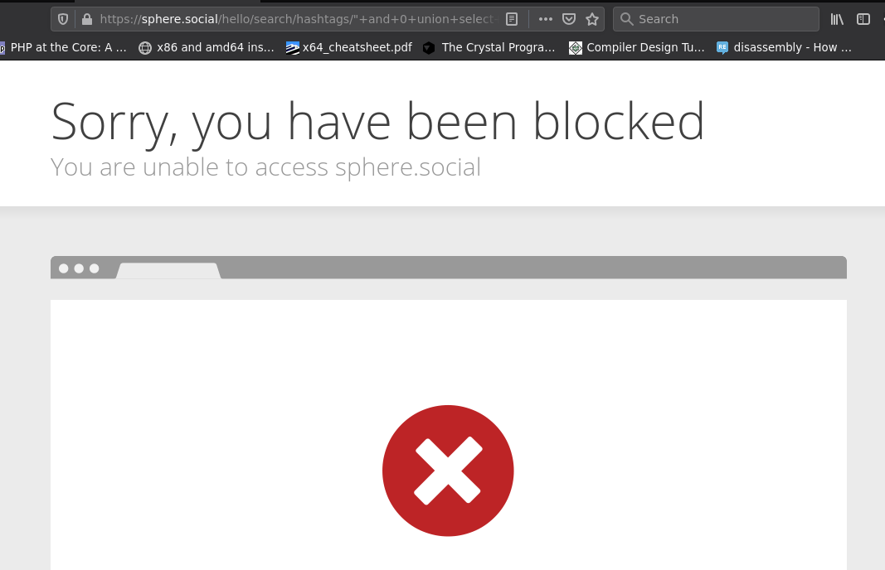
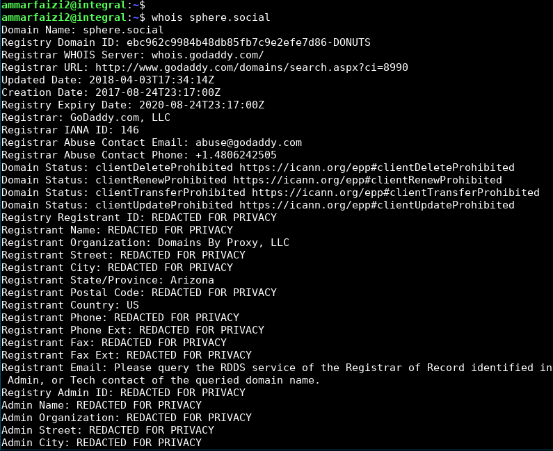
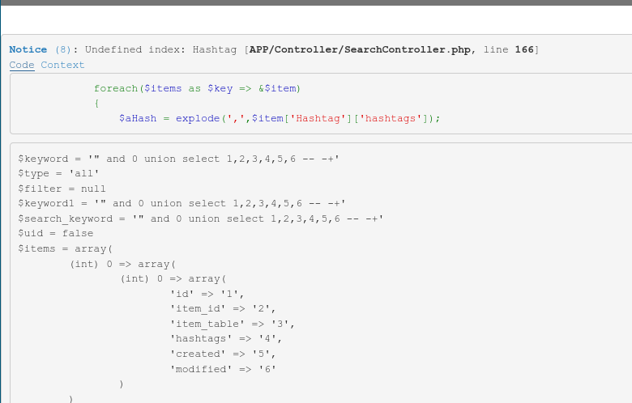
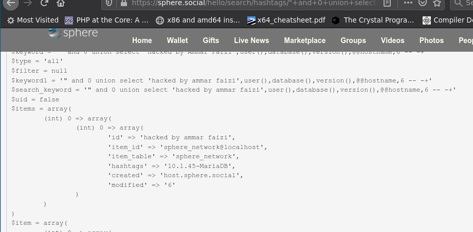

# (1) Analyzing Target
Given the following URL
```
https://sphere.social/hello/search/hashtags/1
```
We know that "1" is the parameter which may involve query to database.

After several times trying to find the injection pattern, I found an error at this endpoint.

```
https://sphere.social/hello/search/hashtags/"
```

and this is what I got. The developer seems did not turn off the debug flag, so it is easier to see what query is being executed. The error looks like this:


If you are experienced in SQL injection, the above situation must be a low-hanging fruit which is easily to be injected. So I tried the following payload:
```
" and 0 union select 1,2,3,4,5,6 -- -+
```

The endpoint become:
```
https://sphere.social/hello/search/hashtags/%22+and+0+union+select+1%2C2%2C3%2C4%2C5%2C6+--+-%2B
```

It was then not that easy, Cloudflare's firewall blocked my attempt and showed me this page:





I was trying to bypass the Cloudflare's firewall with encoding, comment technique and many more, but no success.


But then I realized that Cloudflare is just a DNS proxy.


So basically if we can find the real address of the server behind the Cloudflare, we can easily bypass this extreme firewall.

# (2) Finding Server's IP Address Behind The Cloudflare

I tried to use `whois` to find the domain information, but no success.


The only necessary I got is just the domain was bought from godaddy.



Futhermore, I tried to find the DNS history by using the server from https://viewdns.info/ and this is what I got:


So my conclusion based on the DNS history above was:
1. `50.63.202.45` was the default page when the domain was bought.
2. `50.28.107.96` is the IP address after domain was configured.
3. Then the domain nameserver was moved to the Cloudflare.

Therefore, it is possible that `50.28.107.96` be the real server address behind the Cloudflare.

I tried to check the HTTP port on this address and it redirected me to `https://sphere.social/`.


This is enough evidence to conclude that the server behind the Cloudflare is `50.28.107.96`.

After that, I plug the real server address to my `/etc/hosts` file, and ready to check if the Cloudflare's firewall is gone.


# (3) Reanalyzing Target and Execute The Right Payload
After plugging the real server IP, I tried to go with this endpoint again.
```
https://sphere.social/hello/search/hashtags/%22+and+0+union+select+1%2C2%2C3%2C4%2C5%2C6+--+-%2B
```

But, nothing showed, just something like this.


I tried to expand the code, and here is what I got:



And here we go!

I plugged this payload
```
" and 0 union select 'Hacked by Ammar Faizi',user(),database(),version(),@@hostname,6 -- -+
```

So the endpoint will be
```
https://sphere.social/hello/search/hashtags/%22+and+0+union+select+%27Hacked+by+Ammar+Faizi%27%2Cuser%28%29%2Cdatabase%28%29%2Cversion%28%29%2C%40%40hostname%2C6+--+-%2B
```

Here is what I got:



## End of proof, Q.E.D.